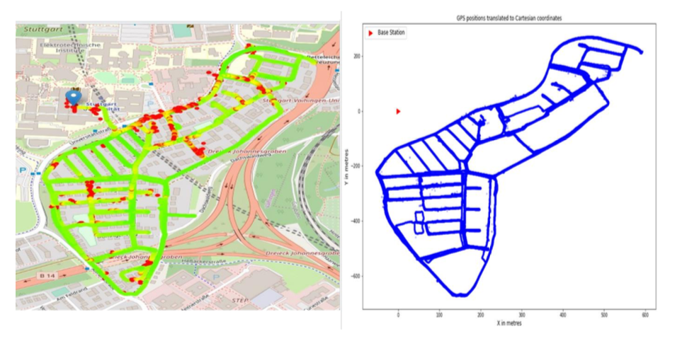

# Outdoor Localization with semi-Supervised Learning
  

Feb, 2020    
Jet Yu, jianyuan@vt.edu    
Dr. R. Michael Buehrer, rbuehrer@vt.edu   
__Wireless, ECE, Virginia Tech__  
TODO  
Dr. SaiDhiraj Amuru, asaidhiraj@iith.ac.in
__Wireless, ECE, IIT__  

# Dataset
under folder `DATA`, for more data, click [DataSet](https://www.dropbox.com/sh/nvgox5e6udpkqni/AACpTPwdQI_8jkRZjHlOGfqPa?dl=0), and `./DATA/README.md` describe the data. 

# How to run
* `mainDNN.py`, supervised learning with labeled data using FreeForward Neural Network
* `mainRF.py`, using Random Forest

# File Description
TODO

  

# Documents
[performance Google slides](https://docs.google.com/presentation/d/1TmBK1706MdWIuUUq2Pz0j-ggvIJp4es5ADyUJjnXqRs/edit?usp=sharing)  
[Performance Google Spreadsheet](https://docs.google.com/spreadsheets/d/1tdd9yWxKShPJNgGVGJ2-OZv7tITa_loKcl66JmtFsoE/edit?usp=sharing)

# News
(Feb 21) starter code online

# Config
running on ARC VT is prefered, run python is preferred.
 * Python
   * `tensorflow`, `Keras`, `scikitlearn`  

